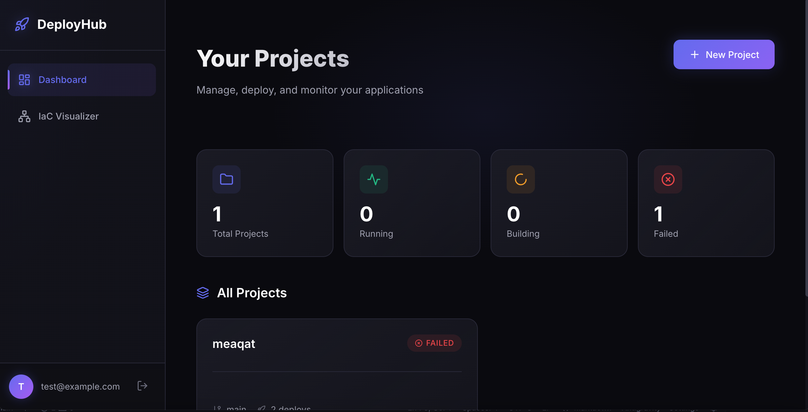
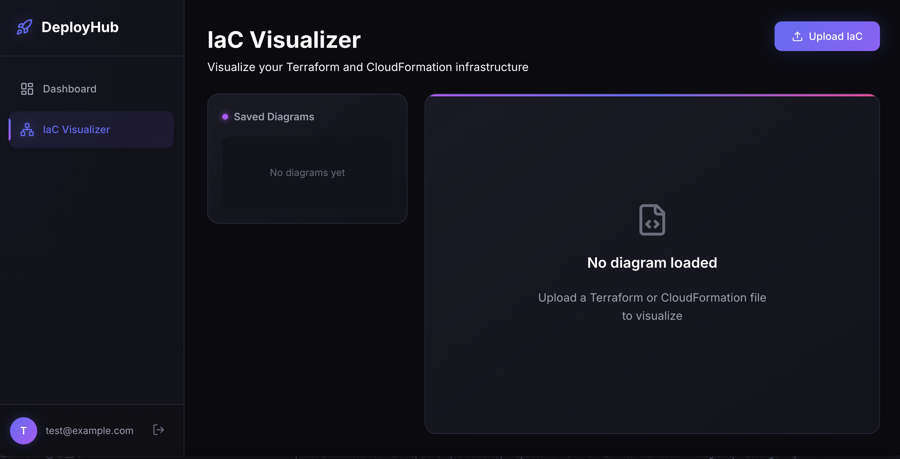

<div align="center">
  <h1>🚀 DeployHub</h1>
  <p><strong>Self-hosted PaaS for deploying any application with zero configuration</strong></p>
  <p>Push your code. We build, containerize, and deploy it automatically.</p>

  <p>
    <a href="#features">Features</a> •
    <a href="#quick-start">Quick Start</a> •
    <a href="#deployment">Deployment</a> •
    <a href="#tech-stack">Tech Stack</a> •
    <a href="#contributing">Contributing</a>
  </p>

  <p>
    
    
    
  </p>
</div>

---

## ✨ Features

- **🔧 Zero Config Deployments** - Push your code, we detect the framework and deploy
- **🌐 9 Language Support** - Node.js, Python, Go, Ruby, Rust, Java, PHP, Elixir, Static
- **🐳 Docker Native** - Custom Dockerfile? We'll use it. None? We generate one
- **📊 IaC Visualizer** - Upload Terraform/CloudFormation and see interactive diagrams
- **📝 Real-time Logs** - Watch your builds and deployments live
- **🔐 Environment Variables** - Securely manage secrets per project
- **🎨 Modern Dashboard** - Beautiful dark-themed UI with responsive design

## 📸 Screenshots

<details>
<summary>View Screenshots</summary>

### Dashboard


### Project Details


### IaC Visualizer


</details>

## 🚀 Quick Start

### Prerequisites

- [Node.js](https://nodejs.org/) 20+
- [Docker](https://www.docker.com/) (for building/deploying projects)

### Development

```bash
# Clone the repository
git clone https://github.com/Codekage25/deployhub.git
cd deployhub

# Install dependencies
npm install

# Start development server
npm run dev
```

Open [http://localhost:5173](http://localhost:5173) - API runs on port 3001.

### Docker (Production)

```bash
# Clone and deploy
git clone https://github.com/Codekage25/deployhub.git
cd deployhub

# Start with Docker Compose
docker-compose up -d --build
```

Open [http://localhost](http://localhost)

## 🌍 Deployment

For production deployment on a VPS, see **[DEPLOY.md](DEPLOY.md)**.

Quick deploy to any VPS (DigitalOcean, Hetzner, Linode):

```bash
# Upload to server
scp -r . root@YOUR_SERVER:/opt/deployhub

# SSH and run setup
ssh root@YOUR_SERVER
cd /opt/deployhub
chmod +x setup-vps.sh
./setup-vps.sh
```

## 🏗️ Architecture

```
deployhub/
├── apps/
│   ├── api/          # Fastify backend
│   │   ├── src/
│   │   │   ├── routes/       # API endpoints
│   │   │   ├── services/     # Builder, deployer, IaC parser
│   │   │   └── db/           # SQLite database
│   │   └── package.json
│   │
│   └── web/          # React frontend
│       ├── src/
│       │   ├── pages/        # Dashboard, Projects, IaC
│       │   ├── components/   # Reusable UI components
│       │   └── api/          # API client
│       └── package.json
│
├── packages/
│   └── shared/       # Shared types
│
├── docker-compose.yml
├── Dockerfile
└── nginx.conf
```

## 🛠️ Tech Stack

**Backend:**
- [Fastify](https://fastify.io/) - Fast, low-overhead web framework
- [SQLite](https://www.sqlite.org/) - Embedded database (via better-sqlite3)
- [Dockerode](https://github.com/apocas/dockerode) - Docker SDK for Node.js
- [simple-git](https://github.com/steveukx/git-js) - Git operations

**Frontend:**
- [React](https://react.dev/) - UI library
- [Vite](https://vitejs.dev/) - Build tool
- [React Flow](https://reactflow.dev/) - IaC diagram visualization
- [Lucide](https://lucide.dev/) - Icons
- [Zustand](https://zustand-demo.pmnd.rs/) - State management

**Infrastructure:**
- [Docker](https://www.docker.com/) - Container runtime
- [Nginx](https://nginx.org/) - Reverse proxy
- [Let's Encrypt](https://letsencrypt.org/) - SSL certificates

## 📚 API Reference

### Authentication

```bash
# Register
POST /api/auth/register
{ "email": "user@example.com", "password": "password" }

# Login
POST /api/auth/login
{ "email": "user@example.com", "password": "password" }
```

### Projects

```bash
# List projects
GET /api/projects

# Create project
POST /api/projects
{ "name": "my-app", "repoUrl": "https://github.com/user/repo", "branch": "main" }

# Deploy project
POST /api/deployments/trigger/:projectId
```

### IaC

```bash
# Parse IaC file
POST /api/iac/parse
{ "name": "my-infra", "sourceType": "terraform", "content": "..." }

# List diagrams
GET /api/iac/diagrams
```

## 🤝 Contributing

Contributions are welcome! Please read our contributing guidelines.

1. Fork the repository
2. Create your feature branch (`git checkout -b feature/amazing-feature`)
3. Commit your changes (`git commit -m 'Add amazing feature'`)
4. Push to the branch (`git push origin feature/amazing-feature`)
5. Open a Pull Request

### Development Setup

```bash
# Install dependencies
npm install

# Run tests
npm test

# Run linter
npm run lint
```

## 📄 License

This project is licensed under the MIT License - see the [LICENSE](LICENSE) file for details.

## 🙏 Acknowledgments

- Inspired by [Heroku](https://heroku.com), [Render](https://render.com), [Railway](https://railway.app)
- Built with ❤️ for developers who want to own their deployment infrastructure

---

<div align="center">
  <p>If you find this useful, please ⭐ star the repo!</p>
  <p>Made with ❤️ by <a href="https://github.com/Codekage25">Abdulkareem Babatunde</a></p>
</div>
